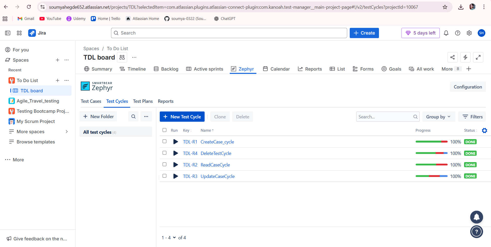

# 📌 To-Do List Web Application – Manual QA Project

This repository contains a **complete manual testing project** for the To-Do List Web Application.  
The goal of this project is to validate all core functionalities including task creation, updating, deletion, status update, and UI behavior.  
All testing activities were performed using **Jira** (for defect tracking) and **Zephyr Scale** (for test management).

---

## 🚀 Project Highlights

- Designed and executed **detailed test scenarios & test cases**
- Logged defects in **Jira** with proper severity and priority levels
- Managed test execution using **Zephyr Scale**
- Prepared documentation including **execution reports**, **traceability**, and **screenshots**
- Demonstrates real-world QA workflow from planning → execution → reporting

---

## 🛠 Tools & Technologies Used

| Category | Tools |
|---------|--------|
| Test Management | **Zephyr Scale** |
| Defect Tracking | **Jira** |
| Documentation & Reports | Excel, PDF |
| OS / Browser | Windows 11, Chrome |

---

## 📄 Test Artifacts

### 🔹 **1. Test Cases**
All test cases are organized based on CRUD operations:

- [Create Test Cases](TestCases/Create_TestCases.xlsx)  
- [Read Test Cases](TestCases/Read_TestCases.xlsx)  
- [Update Test Cases](TestCases/Update_TestCases.xlsx)  
- [Delete Test Cases](TestCases/DeleteTestCases.xlsx)  

---

### 🔹 **2. Jira Bug Report**
Full list of logged defects with description, steps, severity, and screenshots:

👉 [Bug Report (PDF)](Defects/BugReport.pdf)

Screenshots available here:  
👉 `Defects/DefectsScreenshots/`

---

### 🔹 **3. Zephyr Test Cycle Execution**
Includes pass/fail counts, execution summary, and final status:

- [Test Cycle Report 1](TestCycle/TestCycleReport1.pdf)  
- [Test Cycle Report 2](TestCycle/TestCycleReport2.pdf)  
- 

---

### 🔹 **4. Project Reports**
- [Execution Summary](Reports/TestExecutionReport.pdf)  
- [Traceability Report](Reports/TraceabilityReport.pdf)

---

## 📊 Metrics Summary

| Metric | Count |
|--------|-------|
| **Total Test Cases** | *41* |
| **Executed** | *41* |
| **Passed** | *29* |
| **Failed** | *12* |
| **Blocked** | *3* |
| **Total Defects Logged** | *19* |

---

## 🔗 Traceability Snapshot

| Requirement / Feature | Test Case | Execution Result | Jira Defect |
|-----------------------|-----------|------------------|-------------|
| Create Task | TDL-T8 | Fail | Refer BugReport.pdf |
| Update Task | TDL-T22 | Pass | - |
| Delete Task | TDL-T37 | Fail | Refer BugReport.pdf |
| Read Task | TDL-T18 | Pass | - |

---

## 🧪 Key Functional Areas Tested

- Adding new tasks  
- Editing an existing task  
- Deleting tasks  
- Marking tasks as completed/active  
- Filtering tasks (All / Active / Completed)  
- Input validation  
- UI compliance  
- Negative test behavior  
- Regression checks after updates  

---

## 📝 Conclusion

This project demonstrates hands-on experience with **manual testing**, **Jira defect lifecycle**, and **Zephyr Scale test management**.  
It reflects a real-world QA workflow with complete documentation: test cases → execution → defects → reports → traceability.

